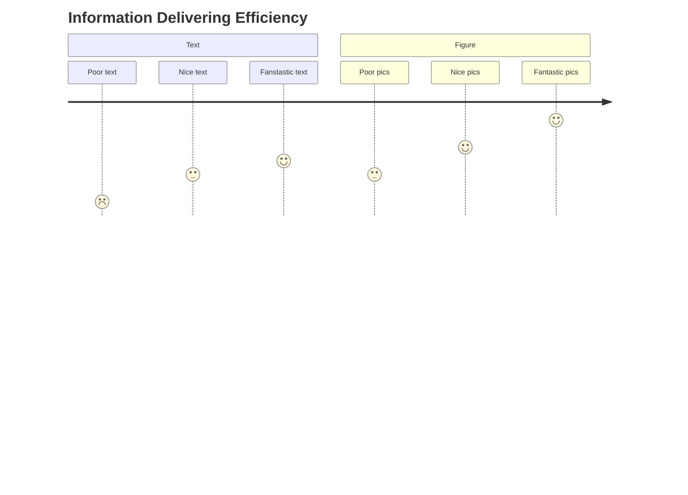
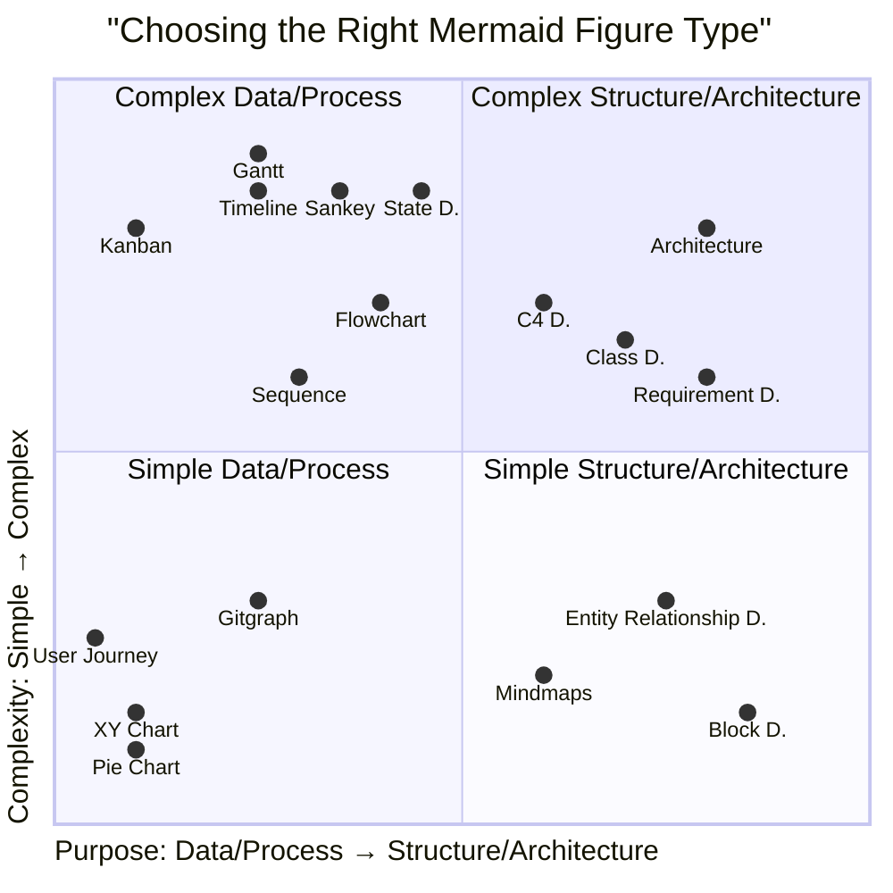
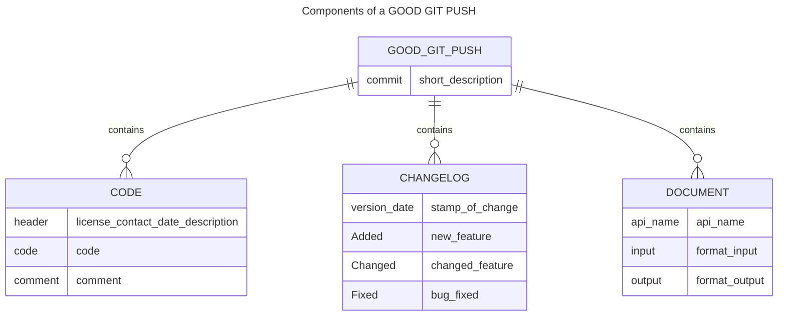
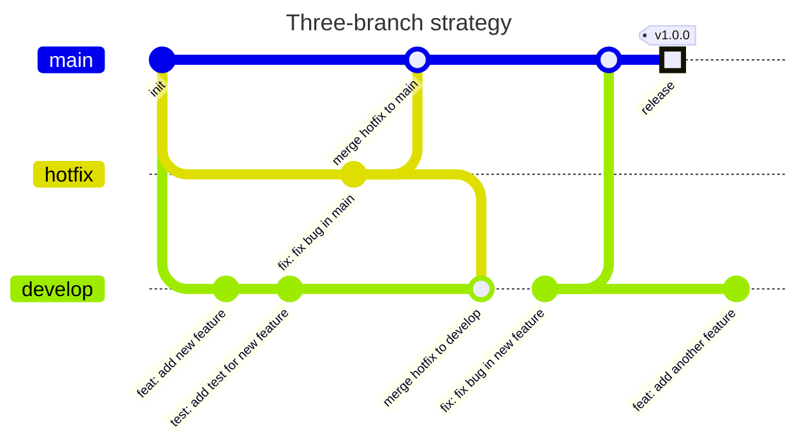
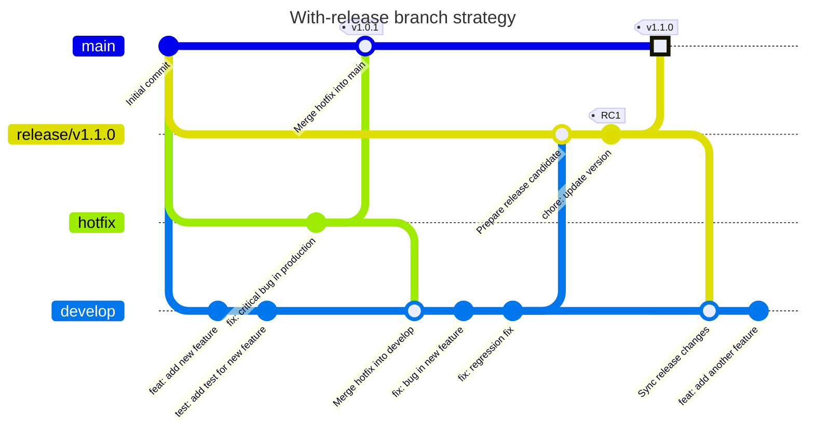
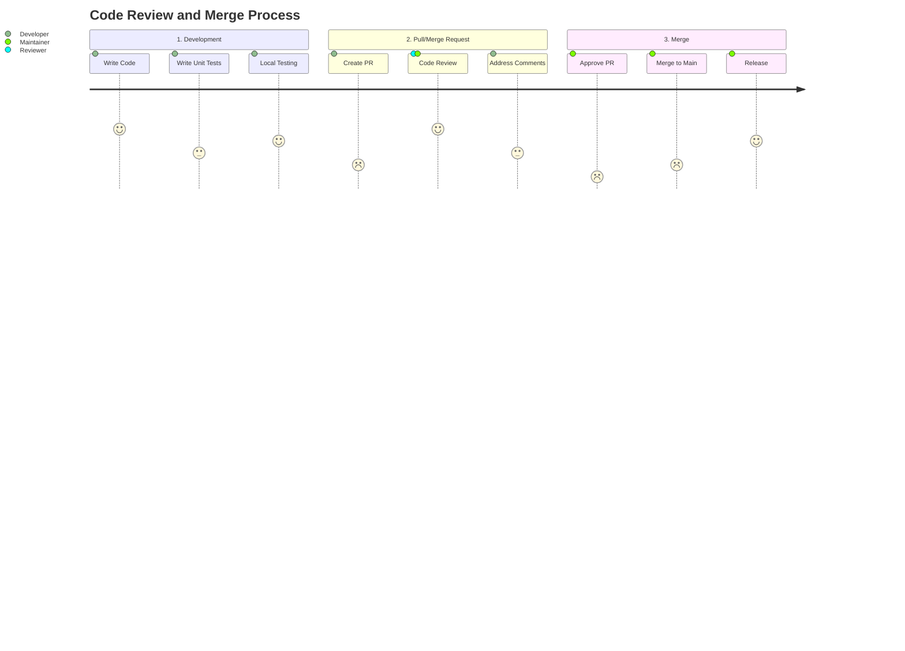

# Dev Guideline

[TOC]

## Write Visually


Figures worth more, especially when they are well designed.


### The Right Figure Type



Here are some extended notes on creating figures in markdown:
- For the ease of editing, use `mermaid` when possible. Fallback to `plantuml` if necessary. Use picture files or draw.io only when the above two options are not available. Attach the code generating the picture if possible.
- The wiki.js integrated mermaid is not the latest version. If you need a new feature, please use the [kroki](https://kroki.io/) service to render the mermaid diagram. Check the source code of this page for examples.

## Document CHANGES Even Tiny

Collaboration means we need to develop on other's shoulder. Document every change when you push, even if it is tiny. 



A satisfying git push should contain the following components:
- **Code**: The code you wrote. 
  - It should be well commented when being pushing to the `dev` branch.
  - **Every functional file** (e.g. `.py`, `.js`) should have a header with the license, contact, date, and description.
- **Changelog**: What's new in this push?
  - All changes should be appended to the `CHANGELOG.md` file.
  - The changelog should be in the following format:
    ```markdown
    ## [Version] - [Date]
    ### Added
    - New feature
    ### Changed
    - Changed feature
    ### Fixed
    - Bug fixed
    ```
- **Document**: The API/function you wrote.
  - If the project is small, the document can be written in the `README.md` file.
  - Otherwise, create markdown files in the `docs` folder.
  - For each **external exposing** APIs or functions, document the following:
    - API name and description
    - Input format and example
    - Output format and example
- **Commit message**: A brief description of the change. Refer to [this post](https://github.blog/developer-skills/github/write-better-commits-build-better-projects/).
    - Recommend to use the `{type}({!scope}): {subject}` format.
      - `type`: The type of change. `feat`(feature), `fix`(bug fix), `docs`(documentation), `style`(formatting), `refactor`(refactoring), `perf`(performance), `test`(testing), `chore`(other changes), `merge`(merging branches).
      - `scope`: The scope of the change. Optional. It can be a module, a file, or a function.
      - `subject`: A brief description of the change. It should be in the imperative mood and start with a verb. For example, `add`, `fix`, `update`, `remove`, etc.
      - Example commit messages: `feat(api): add new API for user login`, `fix(auth): fix bug in user login`, `docs(api): update API document for user login`, `style(auth): format code for user login`, `refactor(auth): refactor code for user login`, `perf(auth): improve performance for user login`, `test(auth): add test for user login`, `chore(auth): update dependencies for user login`.

## Branch Strategy

Ideally, three branches are enough for the project:
- `dev`: The development branch. All changes should be pushed to this branch.
- `main`: The main branch. This branch should be stable and ready for production.
- `hotfix`: The hotfix branch. The branch take care of bugs found during production. It should be merged to `main` and `dev` branches.



Then, why do people use `release` branch? The benefits are:
- for **testing**: The `release` branch can be used for testing the release candidate before merging to `main`.
- for **continuous development**: It's easy to revisit the release branch and do bug fixing. Especially when the main branch is far ahead of the target release branch.

A with-release branch strategy is shown below:


Two above branch srategies are legit in our development. The three-branch strategy is simple and easy to understand. The with-release branch strategy is more complex but provides more flexibility and control over the release process.

In this project, we will use the three-branch strategy. I give the following reasons:
1. The project documents a development guideline. We only have one guideline at a time. The development is quite linear.
2. When it comes to bug fixing. We fix bases in the previous commit. 

Actually, the `hotfix` branch is not necessary in this repo. We can just use the `dev` branch to fix bugs. But I prefer to keep the `hotfix` branch for the sake of clarity and simplicity. The `hotfix` branch is a good practice for future projects.

## Development, Code Review & Merge



A typical code review and merge process consists of three steps:

1. **Development**: Write code and unit tests. Run local tests to ensure the code works as expected.
2. **Pull/Merge Request**: Create a pull/merge request. The reviewer will review the code and provide comments. The developer will address the comments and update the code. The maintainer can be the reviewer, the colleagues can also peer review the code.
3. **Merge**: The maintainer will approve the pull/merge request and merge the code to the main branch. The maintainer will also release the new version of the code. The release process can be automated using CI/CD.

## Development Guidelines and Commands

To contribute to development, follow these steps:

**1. Create a local development branch:**

```
git checkout dev
git pull origin dev  # Ensure the latest changes
git checkout -b feature/<feature-name>
```

**2. Security Fixes Check**: Run [[Snyk](https://easternsawwhet.stjude.org/en/projects/Snyk-Integration)] in the local branch within the IDE to check for security vulnerabilities before committing changes.

**3. Unit Testing**: Write and execute unit tests to validate individual components. Ensure test coverage meets the required threshold.

**4. Commit:**

```
git add .
git commit -m "Added new feature: <feature-description>"
```

**5. Push the branch to remote:**

```
git push origin feature/<feature-name>
```

**6. Merge changes back into dev:** Open a merge request on GitLab targeting dev. After approval, merge the branch.

**7. Delete the feature branch (optional but recommended):**

```
git branch -d feature/<feature-name>
git push origin --delete feature/<feature-name>
```

## Miscellaneous Scenarios During Development

### 1. Stashing Changes Before Switching Branches
**Scenario:** You have uncommitted changes but need to switch branches.

```
git stash
git checkout another-branch
```

To apply the stashed changes later:
```
git stash pop
```

### 2. Merge
**Scenario:** You want to combine changes from one branch into another without rewriting history.

```
git checkout dev
git pull origin dev
git merge feature/<feature-name>
git push origin dev
```

### 3. Rebasing
**Scenario:** You need to update your feature branch with the latest changes from a different branch before pushing. Applies your changes on top of another branch to maintain a linear history.

**1. Ensure you are on your feature branch**
```
git checkout feature-branch
```

**2. Fetch the latest changes**
```
git fetch origin
```

**3. Rebase with main (or any different branch)**
```
git rebase origin/main
```

**4. If conflicts occur, resolve them manually, then continue:**
```
git rebase --continue
```

**5. If you want to abort the rebase process:**
```
git rebase --abort
```

### 4. Cherry-Picking
**Scenario:** You want to apply a specific commit from one branch to another without merging everything.

```
git cherry-pick <commit-hash>
```