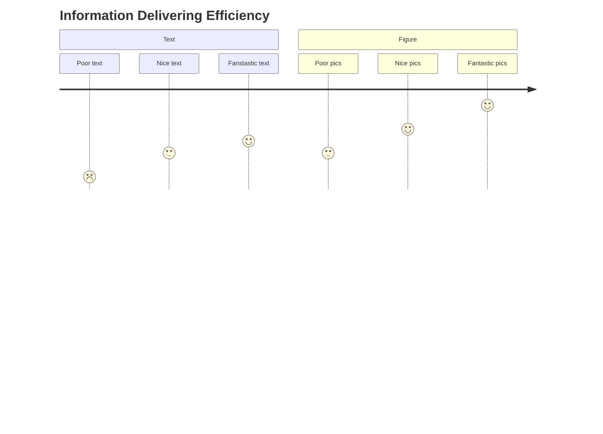
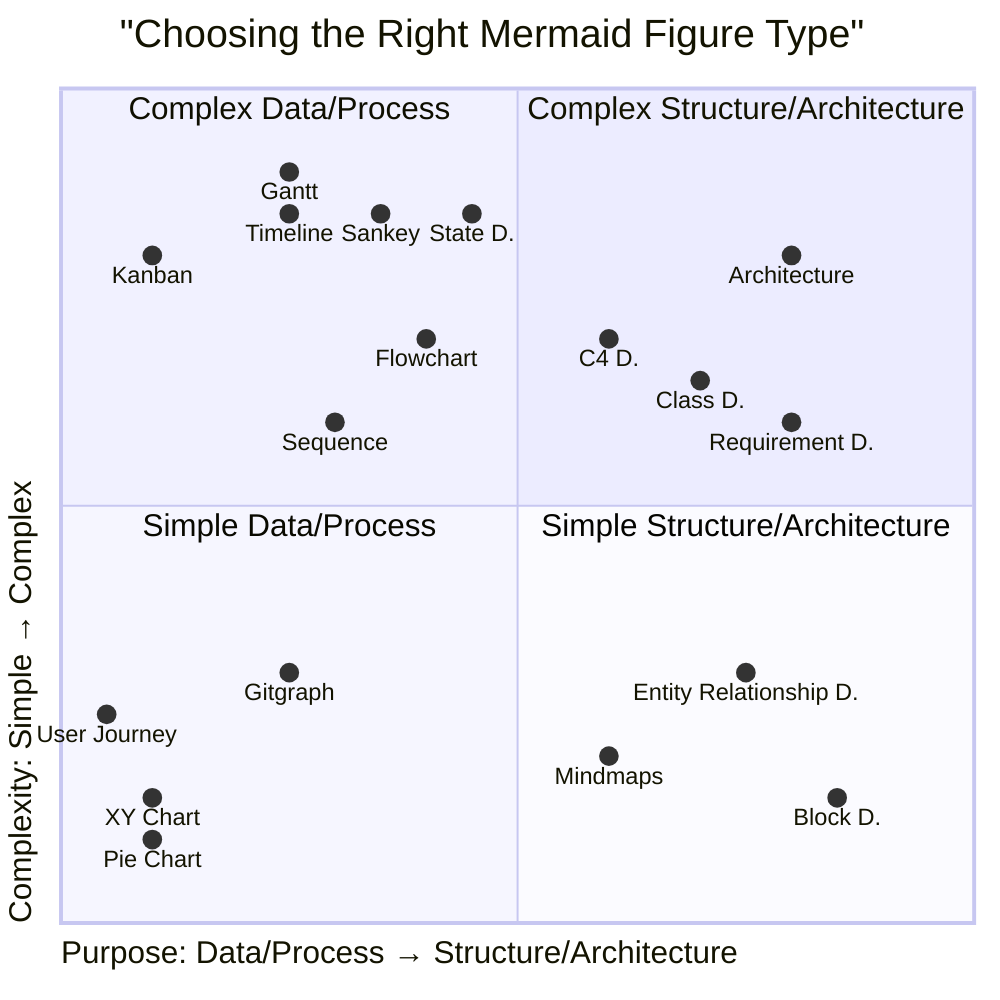
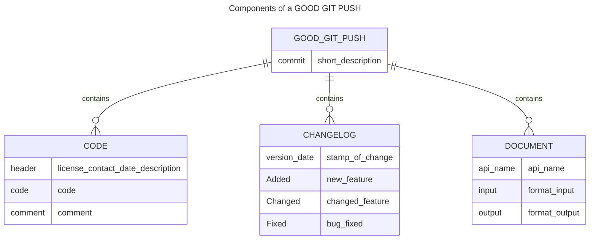
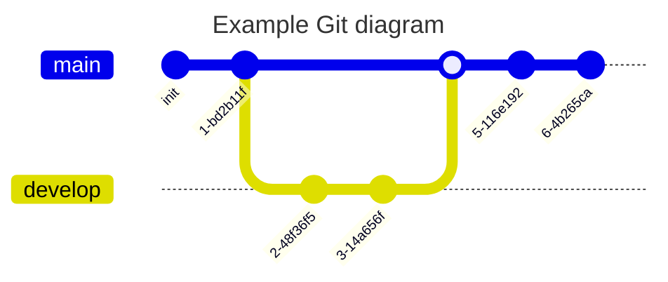
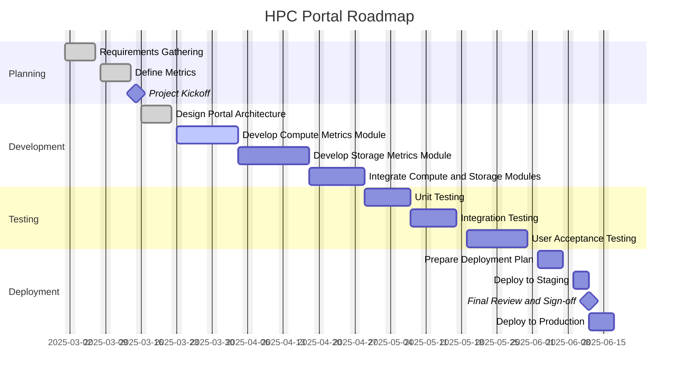

# Dev Guideline

## Always Visualize your idea


Figures are worth a thousand words. Use them to explain your idea. 

But how to choose the right figure?



- Use `mermaid` when possible. Fallback to `plantuml` if necessary.
*The wiki.js integrated mermaid is not the latest version. If you need a new feature, please use the [kroki](https://kroki.io/) service to render the mermaid diagram. Check the source code of this page for examples.*

## Always Document the CODE & CHANGES

Be a thoughtful developer. 



A satisfying git push should contain the following components:
- **Code**: The code you wrote. 
  - It should be well commented when being pushing to the `dev` branch.
  - **Every functional file** (e.g. `.py`, `.js`) should have a header with the license, contact, date, and description.
- **Changelog**: What's new in this push?
  - All changes should be appended to the `CHANGELOG.md` file.
  - The changelog should be in the following format:
    ```markdown
    ## [Version] - [Date]
    ### Added
    - New feature
    ### Changed
    - Changed feature
    ### Fixed
    - Bug fixed
    ```
- **Document**: The API/function you wrote.
  - If the project is small, the document can be written in the `README.md` file.
  - Otherwise, create markdown files in the `docs` folder.
  - For each **external exposing** APIs or functions, document the following:
    - API name and description
    - Input format and example
    - Output format and example
- **Commit message**: A brief description of the change. Refer to [this post](https://github.blog/developer-skills/github/write-better-commits-build-better-projects/).
    - Recommend to use the `{type}({!scope}): {subject}` format.
      - `type`: The type of change. `feat`(feature), `fix`(bug fix), `docs`(documentation), `style`(formatting), `refactor`(refactoring), `perf`(performance), `test`(testing), `chore`(other changes).
      - `scope`: The scope of the change. Optional. It can be a module, a file, or a function.
      - `subject`: A brief description of the change. It should be in the imperative mood and start with a verb. For example, `add`, `fix`, `update`, `remove`, etc.
      - Example commit messages: `feat(api): add new API for user login`, `fix(auth): fix bug in user login`, `docs(api): update API document for user login`, `style(auth): format code for user login`, `refactor(auth): refactor code for user login`, `perf(auth): improve performance for user login`, `test(auth): add test for user login`, `chore(auth): update dependencies for user login`.






